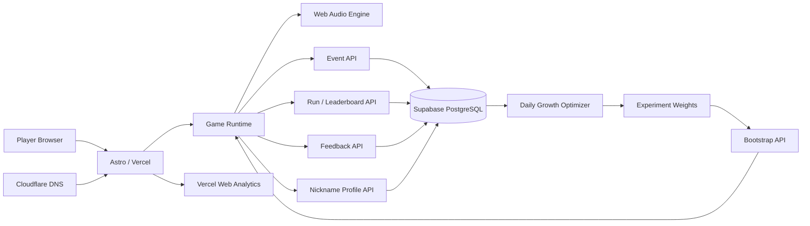

<div align="center">

# 🐈 别吵醒猫咪
### DON'T WAKE THE CAT

**一款只有一个规则，却越来越紧张的真实猫咪网页小游戏。**  
猫咪没看你时偷鱼；它盯着你时，立刻停手。

<br>

<a href="https://cat.fde.fan">
  
</a>
<a href="https://github.com/tubban1/cat/actions/workflows/ci.yml">
  
</a>
<a href="https://github.com/tubban1/cat/actions/workflows/deploy-production.yml">
  
</a>

<br><br>


<br>

**真实猫咪 · 无限难度 · 全球排行榜 · 好友挑战 · 动态音乐 · 数据驱动增长**

[🎮 Play](https://cat.fde.fan) ·
[📊 Growth Loop](docs/GROWTH_LOOP.md) ·
[🧪 Viral Research](docs/VIRAL_RESEARCH_2026.md) ·
[🎵 Audio V2](docs/RELEASE_AUDIO_V2.md)

</div>

---

## ✦ 30 秒看懂

> **拖住小鱼往右偷。**  
> 猫咪放松时继续；出现真正危险信号时，**一毫米都别动**。

游戏没有固定终点。分数越高：

- 节奏越快
- 预警窗口越短
- 假动作越多
- 音乐越紧张
- 全球排名越难往前冲

核心不是“通关”，而是制造那种：

> **“刚刚就差 100ms，再来一局。”**

---

## ✦ 为什么它不只是一个小游戏

<table>
<tr>
<td width="33%" valign="top">

### 🐱 真实猫咪池
每局随机出现真实猫咪。  
当前生产池包含 **12 只精选猫咪**，保留照片来源与摄影师信息。

</td>
<td width="33%" valign="top">

### 🌍 全球排行榜
支持 **今日 / 本周 / 总榜**。  
匿名昵称即可上榜，不要求注册。

</td>
<td width="33%" valign="top">

### ⚔️ 好友挑战
成绩可以生成挑战链接。  
朋友打开后直接看到：

**“超过 TA 的 18 分。”**

</td>
</tr>

<tr>
<td width="33%" valign="top">

### ♾️ 无限难度
没有固定关卡。  
真假预警、双重假动作、缩短反应窗口，让压力持续增长。

</td>
<td width="33%" valign="top">

### 🎵 动态声音系统
背景音乐会跟着分数加速。  
假动作、真预警、心跳、成功、惜败、死亡都有独立声音语言。

</td>
<td width="33%" valign="top">

### 🧪 自动实验
难度参数不是拍脑袋。  
A/B 分流、行为埋点、玩家反馈与 guardrail 一起决定下一版。

</td>
</tr>
</table>

---

## 🎮 Gameplay

```text
真实猫咪出现
      ↓
按住小鱼往右拖
      ↓
猫咪放松 ─────────→ 继续偷
      ↓
假动作 ───────────→ 别被骗
      ↓
真正预警
      ↓
猫咪盯你
   ↙        ↘
停住       还在动
 ↓           ↓
安全         被抓
 ↓           ↓
+1        排名 / 重试
 ↓           ↓
更难 ←──── 再来一局
```

### 游戏越往后发生什么？

| 分数阶段 | 体验 |
|---|---|
| 0–4 | 快速理解规则，建立“我会玩了”的感觉 |
| 5+ | 假动作明显增加 |
| 10+ | 进入高压区，真假信号更接近 |
| 20+ | 高手区，反应窗口继续收紧 |
| ∞ | 没有硬终点，继续冲全球榜 |

---

## 🎵 Audio V2

声音不是装饰，而是游戏信息的一部分。

| 状态 | 声音设计 |
|---|---|
| 正常偷鱼 | 轻量潜行背景音乐 |
| 分数提高 | BPM 与低频逐步增强 |
| 拖动鱼 | 跟手的轻微拨弦 / 滑动声 |
| 假动作 | 沙沙 + 下行短音 |
| 真预警 | 三段上行危险提示 |
| 猫咪盯你 | 音乐收紧 + 双心跳 |
| 熬过注视 | “解除危险”上行音 |
| 偷到鱼 | 三音奖励音 |
| 5 / 10 / 20 分 | 专属里程碑 fanfare |
| 差一点被抓 | near-miss 惜败音 |
| 明显被抓 | 低频撞击 + noise impact |
| 挑战成功 | 单独胜利旋律 |

全部基于 **Web Audio API** 实时生成，不依赖大型 MP3 音频包。

---

## 📈 从“好玩”到“增长系统”

这个项目的目标不是做完一个梗，而是建立：

```text
曝光
 ↓
第一次操作
 ↓
第一次成功
 ↓
死亡 / 惜败
 ↓
重试
 ↓
多局
 ↓
排行榜 / 分享 / 好友挑战
 ↓
新玩家
 ↓
数据
 ↓
实验优化
 ↓
更多有效传播
```

### 显式反馈

玩家可以直接告诉我们：

- 😴 太简单
- 😼 刚刚好
- 😾 不公平
- 可选文字反馈

### 隐式行为反馈

系统同时记录真正决定体验的行为：

`page_view` ·
`first_interaction` ·
`game_start` ·
`fake_cue` ·
`eyes_open` ·
`look_survived` ·
`fish_stolen` ·
`run_end` ·
`retry` ·
`share_complete` ·
`challenge_open` ·
`leaderboard_open` ·
`audio_toggle` ·
`page_hide`

---

## 🧪 数据驱动实验

当前生产实验：**`difficulty_v2`**

两套难度参数同时运行，分流权重保存在 Supabase，因此可以**不重新部署前端**就调整实验流量。

自动优化器每天分析最近 7 天：

1. 每个版本至少达到最低样本量
2. 比较二次开局率
3. 比较分享 / 好友挑战率
4. 用“不公平”反馈作为硬性 guardrail
5. 证据不足 → 保持 50 / 50
6. 明显领先 → 调整到 75 / 25
7. 大样本、优势稳定 → 最多 90 / 10
8. 永远保留探索流量，不锁死 100 / 0
9. 每一次自动调权都写入 audit 表

详细设计见 [docs/GROWTH_LOOP.md](docs/GROWTH_LOOP.md)。

### Adaptive Difficulty V4

当前生产难度系统在 A/B 基础层之上增加了玩家级自适应控制：

- 反应时间分布建模，而不是固定毫秒阈值
- Hazard Function 打破可学习的固定安全节奏
- 五种难度策略臂的 Contextual Thompson Sampling
- 反应 / 欺骗识别 / 不确定性 / 手控 / 高压稳定性五维玩家模型
- 每局结束在线更新，下局重新选择攻击维度
- 150ms 最低可读预警、假动作上限和“不公平”反馈等硬性护栏

详细设计见 [Adaptive Difficulty V4](docs/ADAPTIVE_DIFFICULTY_V4.md)。

---

## 🌍 Leaderboard & Anti-cheat

每局开始时由服务端签发：

```text
runId + token
```

结束后由服务端验证：

- token
- session
- 游戏持续时间
- 分数是否基本符合物理可行范围
- 是否已经提交过该 run

通过后才进入全球榜。

这不是电竞级 anti-cheat，但足以阻止最简单的直接 POST 假高分。

---

## 🧠 Architecture



---

## ⚙️ Stack

<p>


</p>

- **Frontend / Game runtime:** Astro + TypeScript
- **Hosting / Serverless:** Vercel
- **Analytics:** Vercel Web Analytics + custom behavioral events
- **Database:** Supabase PostgreSQL
- **DNS:** Cloudflare
- **Audio:** Web Audio API
- **CI/CD:** GitHub Actions

---

## 🐈 Real Cat Pool

当前生产池中的猫咪素材均经过人工筛选，并在代码中保存来源信息。

```text
src/data/cats.ts
├── cat id
├── display name
├── source image
├── source page
├── photographer
├── mood
└── crop position
```

<div align="center">
  
  
  
  
</div>

---

## 💰 Monetization Philosophy

当前版本**不强行塞广告**。

顺序是：

```text
先证明留存
→ 再证明复玩
→ 再证明好友传播
→ 再测试变现
```

未来优先实验：

- 失败后自愿看广告换一次续命
- 4–6 局后的自然断点广告
- “今日猫咪”品牌赞助
- 宠物用品联盟 / 电商导流

任何变现实验都必须同时观察：

**收入 + 二次开局率 + session 长度 + 分享率 + 负面反馈**

如果收入提高但传播和留存明显下降，就不放量。

---

## 🔐 Privacy & Security

- 不要求注册账号
- 不主动保存 IP
- 昵称绑定匿名 session
- Supabase 数据表启用 RLS
- `anon` / `authenticated` 无直接读写 policy
- 数据库连接串只存在服务端
- 排行榜写入必须通过 server-side run validation

---

## 🚀 Deployment

普通 commit **不会触发 Production Deploy**。

| Commit / Workflow | 行为 |
|---|---|
| 普通 commit | 只跑 CI |
| `[deploy]` | Build + type check + DB check + **1 次 production deploy** |
| `[ops]` | DNS / domain / health check，不重新 deploy |
| Growth Optimizer | 只调整 Supabase 实验权重 |

Production deploy 之后还会自动 smoke test：

```text
bootstrap
→ profile
→ run token
→ score submit
→ leaderboard
→ behavioral events
→ feedback
→ test data cleanup
```

---

## 🛠 Local Development

```bash
npm install
npm run dev
```

生产反馈 / 排行榜 / 实验 API 需要：

```bash
SUPABASE_DB_URL=postgresql://...
```

### Required repository secrets

```text
VERCEL_API_TOKEN
SUPABASE_DB_URL
CLOUDFLARE_ACCOUNT_ID
CLOUDFLARE_API_TOKEN
```

---

## 🗺 Roadmap

- [x] 中文核心玩法
- [x] 真实猫咪随机池
- [x] 全球排行榜
- [x] 好友挑战
- [x] 动态音乐与状态音效
- [x] 昵称持久化
- [x] 行为数据与用户反馈
- [x] A/B 难度实验
- [x] 自动增长报告
- [x] 自动实验流量优化
- [ ] 今日同一只猫挑战
- [ ] 稀有猫图鉴 / 收集
- [ ] 排行榜“附近对手”
- [ ] 多种可录屏死亡反应
- [ ] 9:16 自动短视频分享素材
- [ ] 变现实验

---

## 📚 Docs

| 文档 | 内容 |
|---|---|
| [Growth Loop](docs/GROWTH_LOOP.md) | 持续优化与变现闭环 |
| [Viral Research](docs/VIRAL_RESEARCH_2026.md) | 数据支撑的传播机制研究 |
| [Art Direction](docs/ART_DIRECTION.md) | 视觉设计原则 |
| [Experiments](docs/EXPERIMENTS.md) | A/B 测试与指标 |
| [Audio V2](docs/RELEASE_AUDIO_V2.md) | 当前声音系统 |
| [V2 Release](docs/RELEASE_V2.md) | V2 发布内容 |

---

<div align="center">

### 🐟 你能偷几条？

**[▶ 现在就玩](https://cat.fde.fan)**

<sub>Built as a browser-native social game and growth experiment.</sub>

</div>
